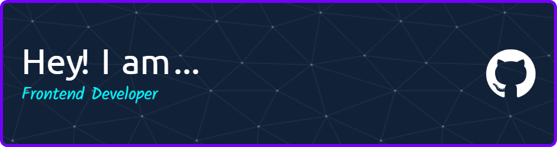

# 👋 Hello there! I'm Vladislav Bashak

Frontend Developer from Ukraine 🥏

* ✨ I develop for all platforms using Typescript/Javascript 
* ✈ Lets talk more in [Telegram](https://t.me/VladBashak)
* 🏢 Currently lokking for job

<!--
**Vlad-syss/Vlad-syss** is a ✨ _special_ ✨ repository because its `README.md` (this file) appears on your GitHub profile.

Here are some ideas to get you started:

- 🔭 I’m currently working on ...
- 🌱 I’m currently learning ...
- 👯 I’m looking to collaborate on ...
- 🤔 I’m looking for help with ...
- 💬 Ask me about ...
- 📫 How to reach me: ...
- 😄 Pronouns: ...
- ⚡ Fun fact: ...
-->
